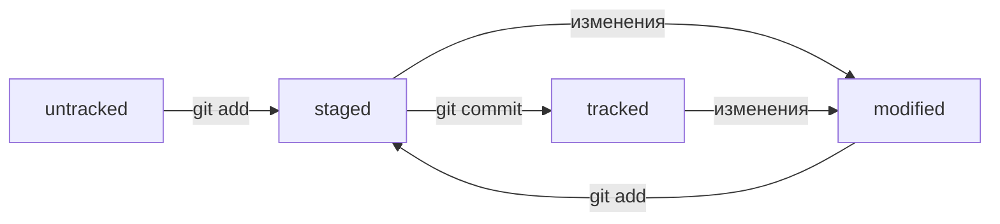

# Шпаргалка по Git

### Git - система контроля версий

Система контроля версий — это программное обеспечение, которое помогает отслеживать изменения в программах, текстовых файлах, больших документах, веб-сайтах и так далее.

## Основные функции системы контроля версий:
- хранит историю изменений в виде отдельных ревизий;
- позволяет манипулировать историей: например, менять порядок ревизий, полностью удалять версии, возвращаться назад в истории;
- помогает анализировать изменения: например, кто и когда вносит изменения, кто чаще всего вносит изменения в определённый файл и так далее.

## В каких случаях стоит использовать Git?
- Для синхронизации изменений, сделанных разными участниками команды.
- Чтобы хранить историю изменений файлов при командной работе.
- Для хранения нескольких версий проекта, над которым работает один человек.

## Основные команды Git.

**git init**  
Чтобы Git начал отслеживать изменения в проекте, папку с файлами этого проекта нужно сделать **Git-репозиторием**.  
Для этого следует переместиться в неё и ввести команду git init

**git status**  
Проверить статус, или состояние, репозитория поможет команда git status.

**git add**  
Добавляет в репозиторий файлы.  
git add <имя_файла> #*один файл*  
git add --all #*все файлы*  
git add . #*всю текущую папку*

**git commit**  
Выполнить коммит.  
git commit -m 'описание коммита'

**git log**
Просмотреть историю коммитов.  
git log

**git remote add**
Привязать удалённый репозиторий к локальному.
git remote add <имя удалённого репозитория - origin> <его URL - скопировать со страницы удалённого репозитория>  
Убедиться, что репозитории связаны поможет команда git remote -v

**git push**
Отправить изменения на удалённый репозиторий.  
В первый раз эту команду нужно вызвать с флагом -u и параметрами origin (имя удалённого репозитория) и main или master (название текущей ветки).  
Флаг -u свяжет локальную ветку с одноимённой удалённой.

## Хеш коммита.
- Git преобразует информацию о коммитах с помощью алгоритма SHA-1 и для каждого из них рассчитывает уникальный идентификатор — хеш.
- Хеш — основной идентификатор коммита и позволяет узнать его автора, дату и содержимое закоммиченных файлов.
- Все хеши, а также таблицу соответствий хеш → информация о коммите Git хранит в папке .git

## Исследуем лог.

Элементы, из которых состоит описание коммита:
- строка из цифр и латинских букв после слова commit — это хеш коммита;
- Author — имя автора и его электронная почта;
- Date — дата и время создания коммита;
- в конце находится сообщение коммита.

Можно вызвать не только полный лог, но и сокращённый — это делается командой git log --oneline.
Сокращённый лог полезен, если нужно быстро найти нужный коммит среди сотни других.

В сокращённом логе выводятся сокращённые хеши — их можно использовать точно так же, как и полные.

## HEAD.

При вызове команды git log после хеша одного из коммитов выводится надпись (HEAD -> master).
HEAD это:
- Это файл в папке .git, в котором записана ссылка (или ссылка на ссылку) на последний коммит.
- Это синоним хеша последнего коммита — его можно передавать командам Git в качестве параметра.

В числе прочих файлов в папке .git есть служебный файл HEAD. Он указывает на самый свежий коммит.

Если нужно передать последний коммит, то вместо его хеша можно просто написать слово HEAD — Git поймёт, что имеется в виду последний коммит.

## Статусы файлов в Git.

Статусы:
- untracked (англ. «неотслеживаемый»). 
Новые файлы в Git-репозитории помечаются как untracked, то есть неотслеживаемые. Git «видит», что такой файл существует, но не следит за изменениями в нём. 
У untracked-файла нет предыдущих версий, зафиксированных в коммитах или через команду git add.
- staged (англ. «подготовленный»). 
После выполнения команды git add файл попадает в staging area (от англ. stage — «сцена», «этап [процесса]» и area — «область»), то есть в список файлов, которые войдут в коммит. 
В этот момент файл находится в состоянии staged.
- tracked (англ. «отслеживаемый»).
Состояние tracked — это противоположность untracked. Оно довольно широкое по смыслу: в него попадают файлы, которые уже были зафиксированы с помощью git commit, а также файлы, которые были добавлены в staging area командой git add. То есть все файлы, в которых Git так или иначе отслеживает изменения.
- modified (англ. «изменённый»).
Состояние modified означает, что Git сравнил содержимое файла с последней сохранённой версией и нашёл отличия. Например, файл был закоммичен и после этого изменён.

Для файлов в состояниях staged и modified обычно не указывают, что они также tracked, потому что это состояние подразумевается.

Типичный жизненный цикл файла в Git

Саммари:
- Статусом untracked помечается файл, о существовании которого Git знает, но не следит за изменениями в нём. Этот статус — противоположность tracked, в который попадают все файлы, отслеживаемые Git.
- Файл переходит в статус staged после выполнения git add.
- Статус modified означает, что файл был изменён.
- Большинство файлов в проектах «шагает» по следующему циклу: «изменён» → «добавлен в список на коммит» → «закоммичен» → «изменён» → и так далее.

## Оформление сообщений к коммитам.

Есть общие рекомендации по тому, как правильно составить сообщение. Оно должно быть:
- относительно коротким, чтобы его было легко прочитать;
- информативным.

Без единообразия коммитов нет и эффективной работы в Git.
Например, правила могут быть такие:
- длина сообщения от 30 до 72 символов;
- первое слово — глагол в инфинитиве («исправить», «дополнить», «добавить» и другие);
- и так далее.

